# SPSS Student Performance Workflow

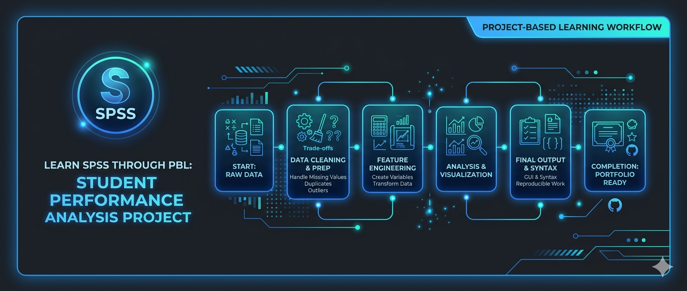


This project is designed as a **PBL (Project-Based Learning)** workflow.
You learn SPSS by completing a realistic end-to-end student performance analysis project instead of only reading theory.

## Why This PBL Project Is Useful

By doing this project, learners can:

- Build practical SPSS skills from raw data to final output.
- Practice data cleaning decisions with real trade-offs (missing values, duplicates, outliers).
- Learn feature engineering for better analysis and visualization.
- Improve confidence with both SPSS GUI and SPSS syntax.
- Produce reproducible work that can be shared in academic or professional settings.

---

### Quick Start: 

| Make the project yourself by Reading this Documentation | Download and View The proect in your Computer |
|------|-------------|
| 1. Download the data-raw.xlsx from this repository. `Then` import  the excel in spss and start following the steps from [Phase 1](#phase-1-data-cleaning) | Click 'code' and download as ZIP, then extract to your local drive. `Then` Open `spss/files/main.sav` in SPSS to start working/viewing |

## Table of Contents

1. [Project Overview](#project-overview)
2. [Project Folder Structure (Visual)](#project-folder-structure-visual)
3. [Data Import](#data-import)
4. [Phase 1: Data Cleaning](#phase-1-data-cleaning)
5. [Phase 2: Feature Engineering](#phase-2-feature-engineering)
6. [Visualization](#visualization)
7. [Merging Datasets](#merging-datasets)
8. [Select Cases in SPSS](#select-cases-in-spss)
9. [Descriptive Statistics in SPSS](#descriptive-statistics-in-spss)
10. [Custom Tables in SPSS](#custom-tables-in-spss)
11. [Correlation Analysis](#correlation-analysis)
12. [Regression Analysis](#regression-analysis)
13. [Export Cleaned Dataset](#export-cleaned-dataset)
14. [SPSS Syntax Quick Reference](#spss-syntax-quick-reference)
15. [Notes](#notes)

---

## Project Overview

This README documents a complete SPSS workflow for:

- Importing raw student data
- Cleaning inconsistent and missing values
- Handling duplicates and outliers
- Creating engineered features
- Producing charts for analysis
- custom tables for reporting
- Running descriptive statistics, correlation, and regression analyses
- Exporting a final cleaned dataset

The workflow is reproducible using both SPSS GUI actions and syntax.

---

## Project Folder Structure (Visual)

```text
SPSS/
|-- README.md
|-- data/
|   |-- raw/          # Original source files (do not modify, just import into SPSS)
|   |-- cleaned/      # Final processed datasets and exports
|   `-- Source/       # Data dictionary and reference notes to understand variables
`-- spss/
	|-- files/        # Main .sav working files during analysis
	|-- syntax/       # Reproducible SPSS scripts (.sps)
	`-- output/       # SPSS output viewer files (.spv)
```

How to read this structure:

- `data/raw` is your immutable input layer. (do not modify this files)
- `spss/files` is the working layer where transformations are applied.
- `spss/syntax` is the logic layer that makes your workflow reproducible.
- `spss/output` is the reporting layer for generated analysis output.
- `data/cleaned` is your publish/share layer for final deliverables.

---

## Data Import
you can import data into SPSS manually or using syntax. The key is to ensure that you correctly specify delimiters, decimal symbols, and variable names during import to avoid issues later in the workflow.

### Import from CSV (GUI)

1. Open SPSS path `File > import Dats > CSV data > Choose CSV file`.
2. In the Text Import Wizard:
	 - Set decimal symbol correctly (comma if needed).
	 - Confirm variable names are in row 1.
	 - Verify delimiter and text qualifier by checking the raw CSV.
	 - Confirm preview before finishing.

### Import from Excel (Manuallay/GUI)
1. Open SPSS path `File > import Dats > Excel data > Choose Excel file`.
2. In the Excel Import Wizard:
	 - Select the correct sheet (e.g., `data-raw`).
	 - Ensure "Read variable names from the first row of data" is checked. (if the first row contains variable names)
	 - Confirm preview before finishing.

### Import from Excel (Syntax)

```spss
GET DATA
	/TYPE = XLSX
	/FILE = 'your_file_path_here.xlsx'
	/SHEET = name 'data-raw'
	/READNAMES = ON.
```

After import, save the dataset as `.sav` for processing.


---

## Phase 1: Data Cleaning

### 1) Profile Variables with Frequencies

Use frequency tables to detect:

- Missing values by variable
- Inconsistent categorical coding (for example, `f`, `Female`, `M`, `male`)

Path: `Analyze > Descriptive Statistics > Frequencies`

we can identify missing values in `famrel` and `studytime`, and inconsistent coding in `sex` from the frequency output.

| step | screenshot |
|------|-------------|
|Run frequency to detect problems | 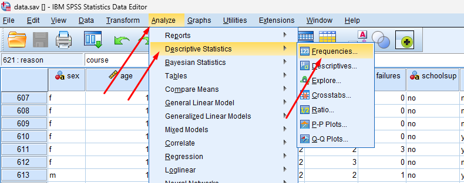 |
|We find coding issues in `sex` and missing values in `famrel` and `studytime`| 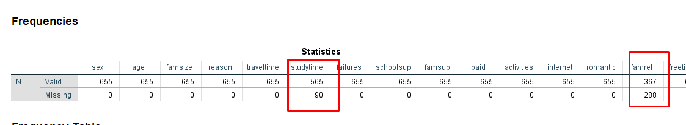 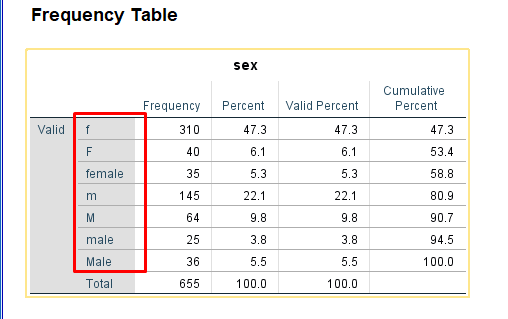 |

### 2) Standardize the `sex` Variable

- Recode inconsistent text values into standard `M` and `F`.
- Use **Recode into Same Variables** to edit the same `sex` variable column.

Then define value labels in Variable View for readability.

| step | screenshot |
|------|-------------|
|Menu|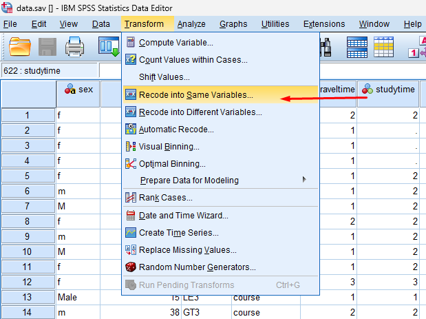| 
|select variable|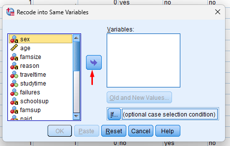|
|select new values by clicking `Old and New Values` button|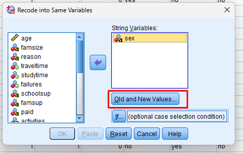|
|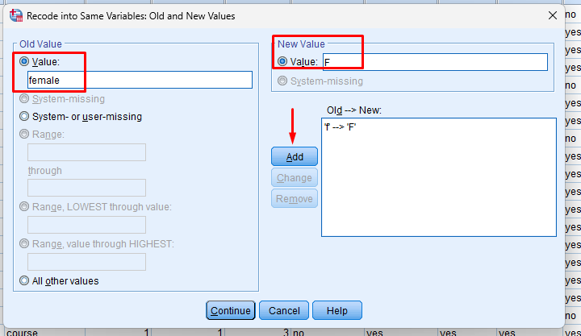|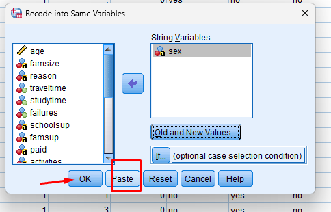|


**we can achive the same by the following syntax:**

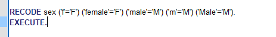


### 3) Create Numeric Sex Variable

we want to Create a new variable such as `sex_numeric`:

- `M -> 0`
- `F -> 1`

Use **Recode into Different Variables** because this is a new variable.

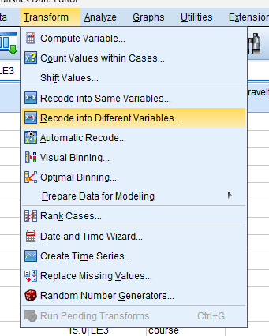

| step | screenshot |
|------|-------------|
|enter new variable name and label, then set the recode values by clicking `Old and New Values` button.|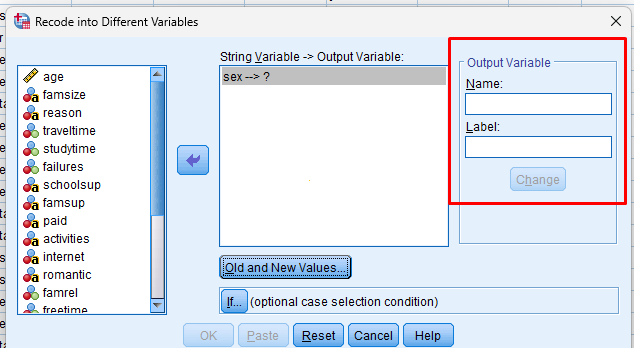 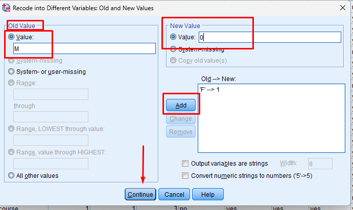|
### 4) Handle Missing Values

From profiling (the frequency tables):

- `famrel` has high missingness (about 44%): drop the variable if it has low analytical value.
- `studytime` has moderate missingness (about 13%): impute with mean.
	`transform>replace missing values>selcect studytime> method: series mean>ok`

Example syntax to drop a variable:

```spss
DELETE VARIABLES famrel.
```

to replace missing values with mean for studytime:
| step 1 |      step 2 |
|------|-------------|
|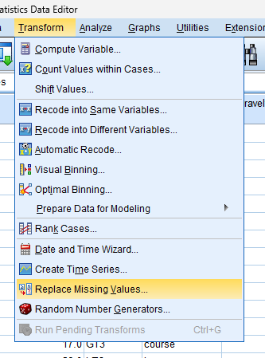 | 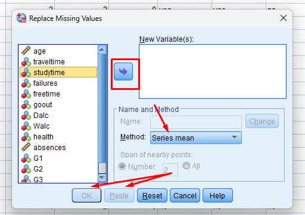 |


### 5) Detect Outliers

Path: `Graphs > Legacy Dialogs > Boxplot`
- the numbers in the boxplot represent case numbers, which can be used to identify outlier records in the dataset.
- Use case numbers shown in the chart to inspect outlier records.
- In this project, outlier values were corrected by cross-checking with the source dataset.

| step 1 | Output |
|------|-------------|
|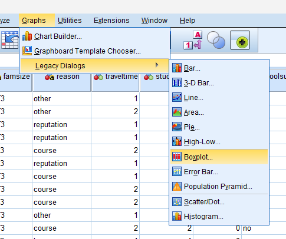|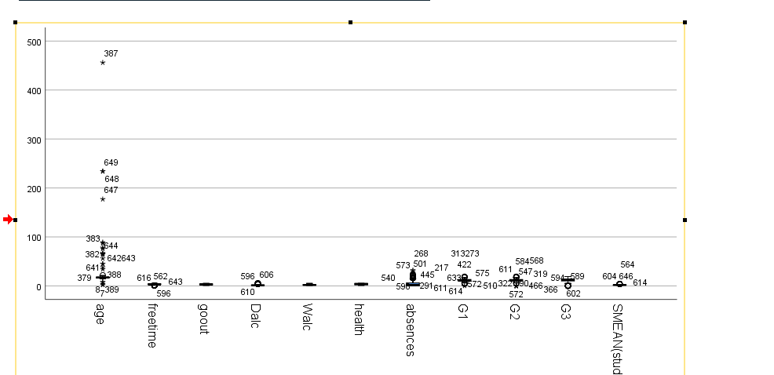|

### 6) Detect and Remove Duplicate Cases

Path: `Data > Identify Duplicate Cases`

**It is important to remove duplicates before creating new features to avoid propagating errors.**

1. Define matching cases by selecting the variables that identify duplicates.
2. If there is no unique ID, use all variables for duplicate detection.
3. Sort within groups to determine which row becomes the primary case.
4. SPSS creates `PrimaryLast` automatically:
	 - `1` = primary row (keep)
	 - `0` = duplicate row

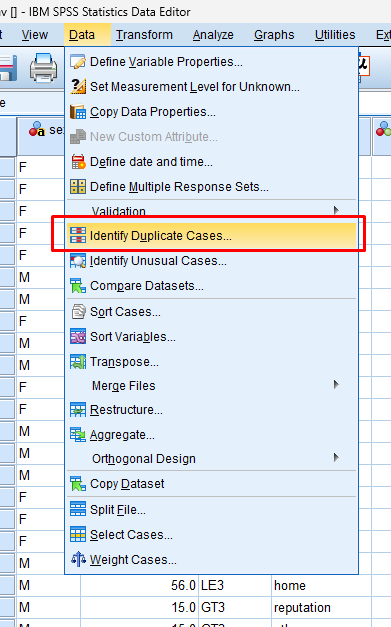
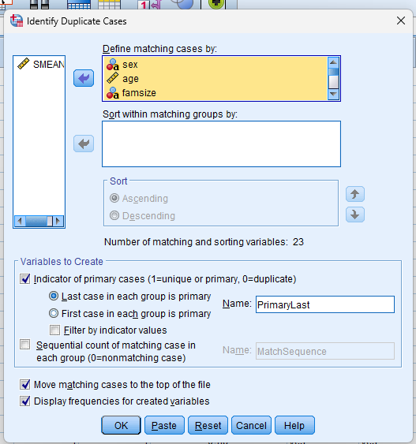


Now we will Keep only primary rows:

```spss
SELECT IF (PrimaryLast = 1).
EXECUTE.
```


---

## Phase 2: Feature Engineering

### 1) Add Student ID

Assign a case-based ID:

```spss
COMPUTE student_id = $CASENUM.
EXECUTE.
```

### 2) Create Final Grade

Combine three grade components into one percentage feature:


```spss
COMPUTE finalGrade = ((G1 + G2 + G3) / 60) * 100.
EXECUTE.
```
or manually,
| step 1 | step 2 |
|------|-------------|
|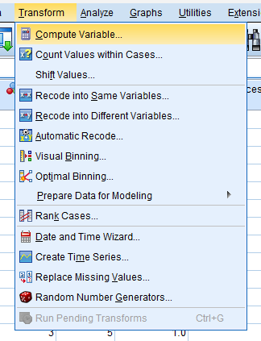 | 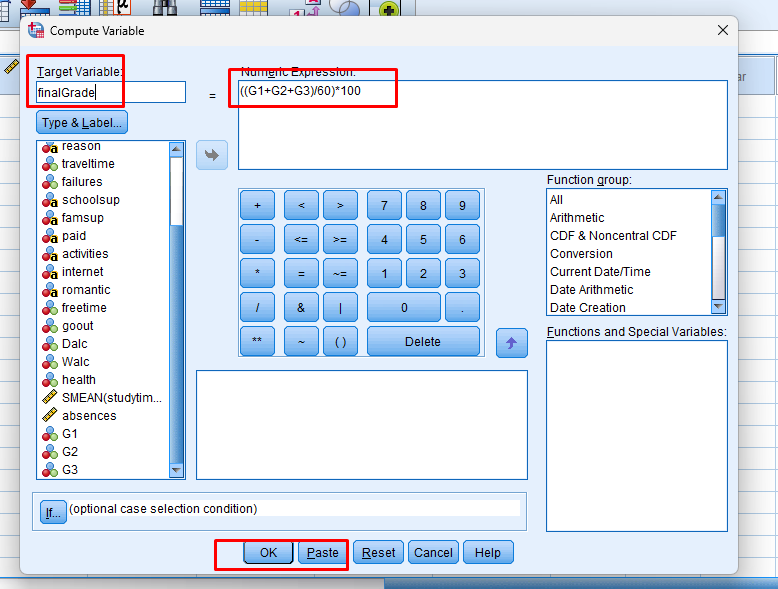|

```

### 3) Create Pass/Fail Flag

Example logic:

- `finalGrade >= 40` -> Pass (`1`)
- Otherwise -> Fail (`0`)

Use **Recode into Different Variables** or `DO IF` syntax.

### 4) Generate Random District Variable

Generate a random district code from 1 to 8 and then apply value labels.

```spss
COMPUTE district = RND(RV.UNIFORM(1, 8)).
EXECUTE.
```
or we can do this manually:

|step 1| step 2 | step 3 |
|------|------|-------------|
| `transform>compute Variable`|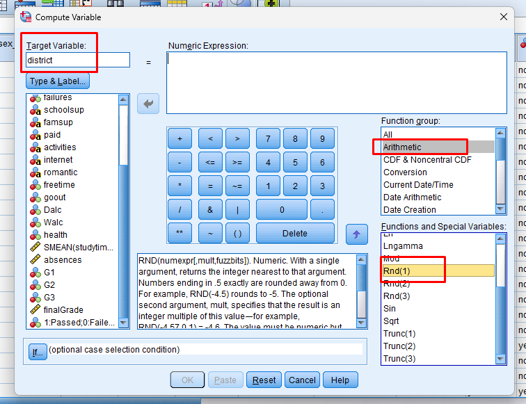 | 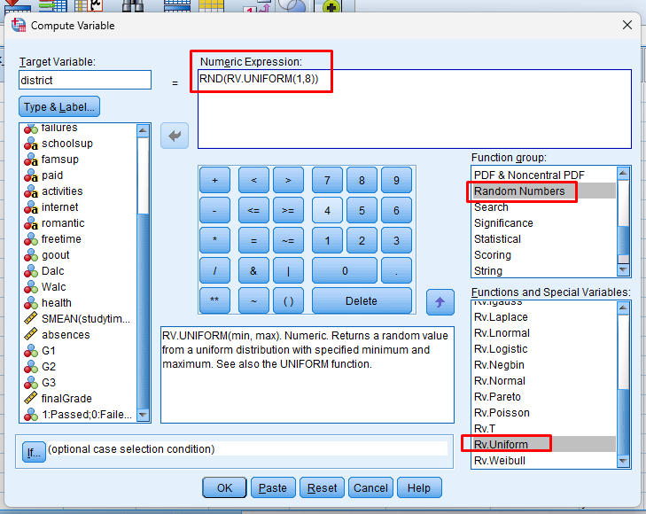 |

#### adding value labels 
Then label values (for example: `1=Dhaka`, `2=Chattogram`, etc.).
for this: `variable view>district>values>three dots` and add value labels.


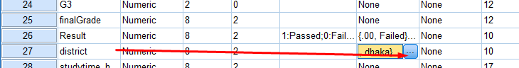

| Screenshot | click the following button to see labels |
|------|-------------|
|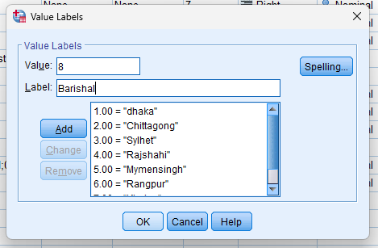 | 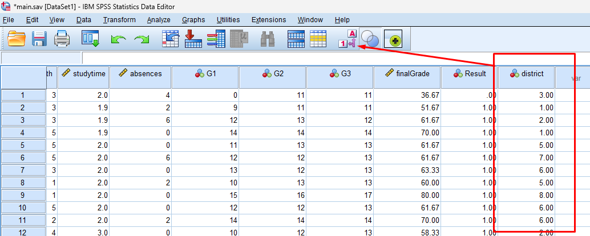|

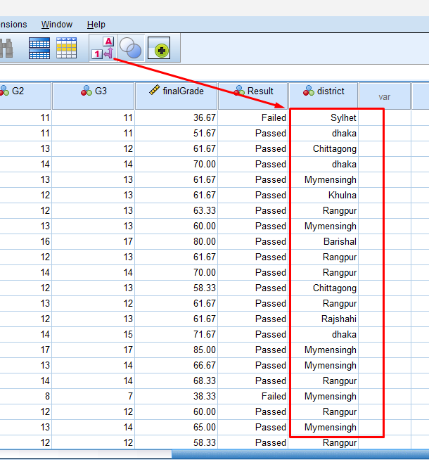
---
### 5) Convert Ordinal Study Time into Estimated Hours

Because `studytime` is ordinal (1 to 4), map each category to a realistic hour range:

```spss
DO IF (studytime <= 1).
	COMPUTE studytime_hours = RV.UNIFORM(0, 2).
ELSE IF (studytime <= 2).
	COMPUTE studytime_hours = RV.UNIFORM(2, 5).
ELSE IF (studytime <= 3).
	COMPUTE studytime_hours = RV.UNIFORM(5, 10).
ELSE IF (studytime <= 4).
	COMPUTE studytime_hours = RV.UNIFORM(10, 15).
END IF.
EXECUTE.
```

Brief explanation:

- SPSS checks each row's `studytime` category.
- It assigns a random hour value inside a category-specific range.
- This creates a continuous variable (`studytime_hours`) suitable for scatterplots.


---

## Visualization

Path: `Graphs > Chart Builder`

Recommended charts:

- Bar chart
- Boxplot
- Scatterplot (`studytime_hours` vs target variables)

If `studytime` is not converted to a continuous variable, scatterplots stack at only four x-values (1, 2, 3, 4), limiting trend visibility.

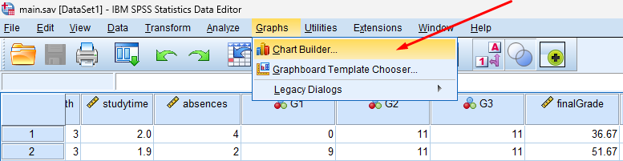

| Chart Type | Output |
|------|-------------|
|Bar Chart|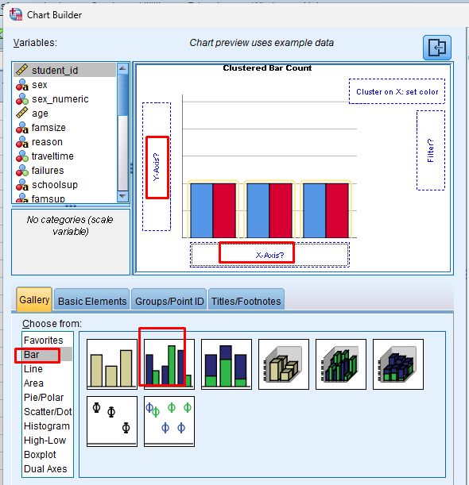 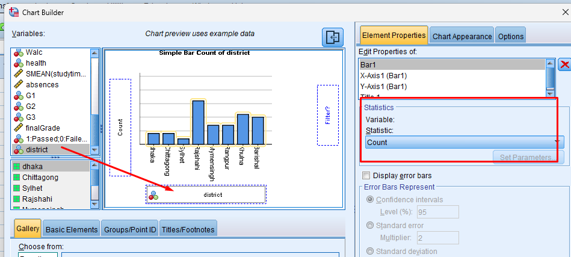 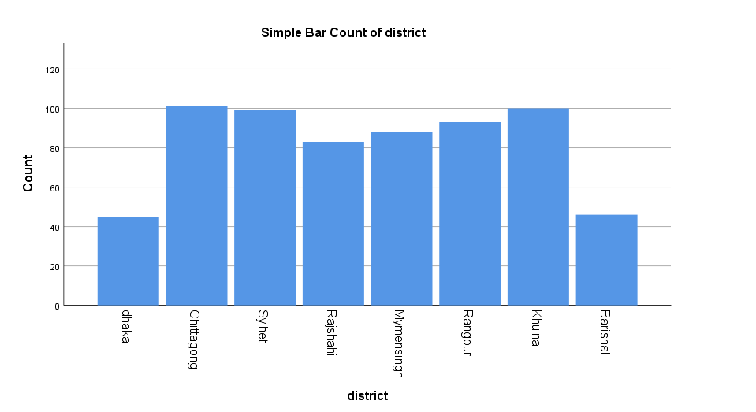|
|Boxplot|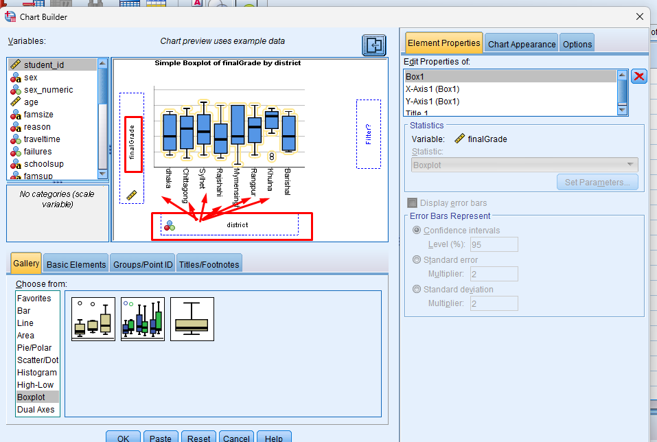 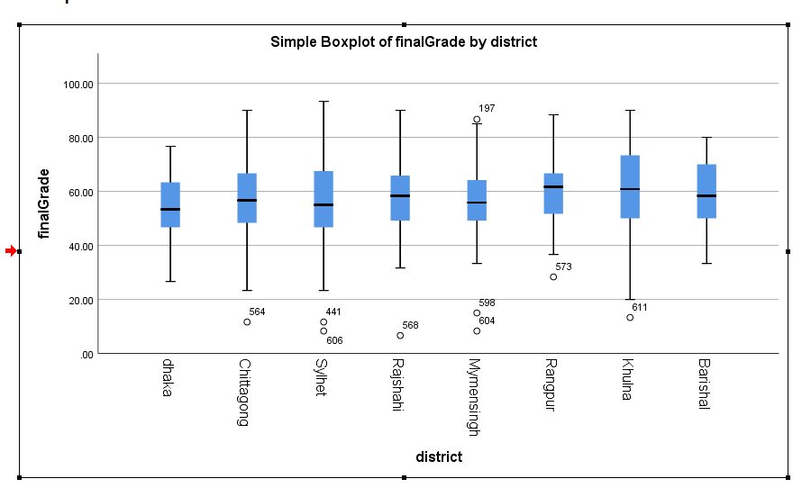|
|Scatterplot|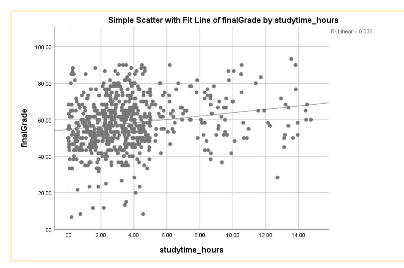|

---

## Merging Datasets

You may need two merge scenarios:

- **Situation 1 (Add Variables):** same students, additional variables from another file.
- **Situation 2 (Add Cases):** new student rows to append.

### Situation 1: Add Variables

Assume your cleaned file is `main.sav` and a second file (`new_variables.sav`) contains the same `student_id` plus new fields.

Create the second dataset (example for IDs):

```spss
INPUT PROGRAM.
LOOP student_id = 1 TO 649.
	END CASE.
END LOOP.
END FILE.
END INPUT PROGRAM.
EXECUTE.
```

Then create:

- `scholarship_status` (1 = Yes, 0 = No)
- `socialMediaEngagement` (1 to 4)
here is the two new variable of the new data set. check out previous lessons if you cannot do it yourself:

**new_variables.sav** path: `spss/files/new_variables.sav`
| Screenshot 1 | Screenshot 2 |
|------|-------------|
|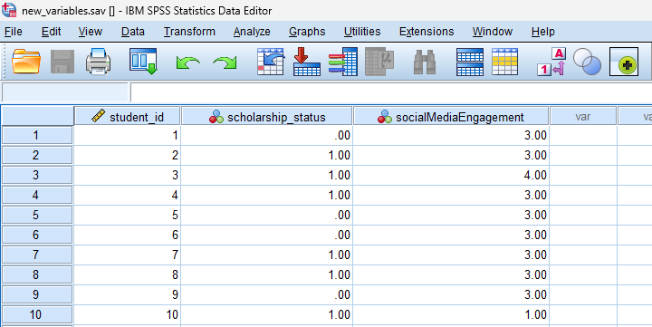 | 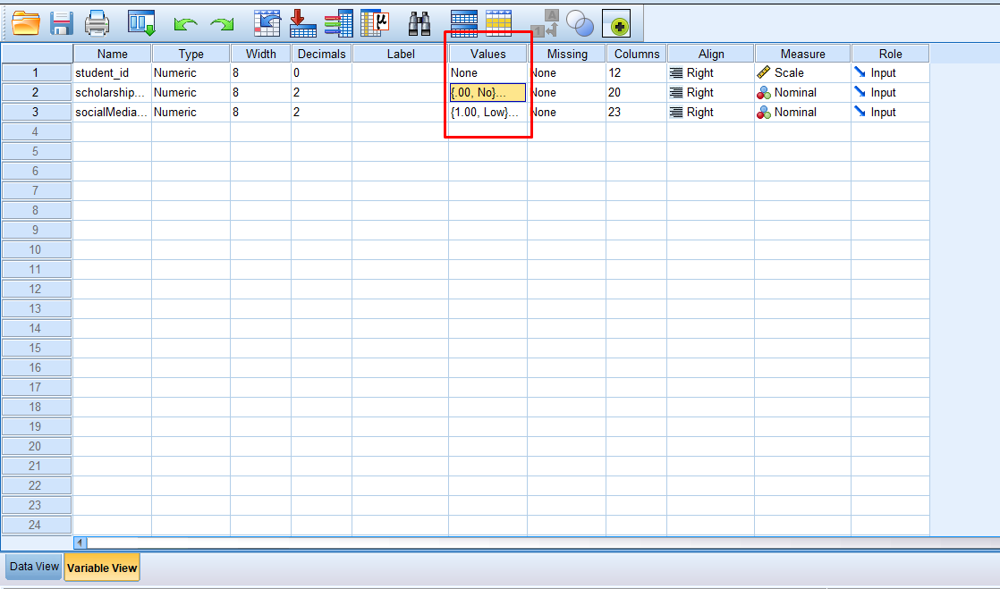|

Add value labels to the new variables for clarity: check [how to add value labels](#adding-value-labels) section if you forgot.

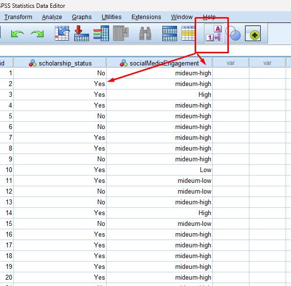

Save as `spss/files/new_variables.sav`.

Once our second dataset is ready, we can merge it with the main dataset.
Merge steps:

1. Open both datasets in SPSS.
2. Sort both by `student_id` (`Data > Sort Cases`).
3. Go to `Data > Merge Files > Add Variables`.
4. Select `new_variables.sav` as source.
5. Match by `student_id`.

| step 1 | step 2 |
|------|-------------|
|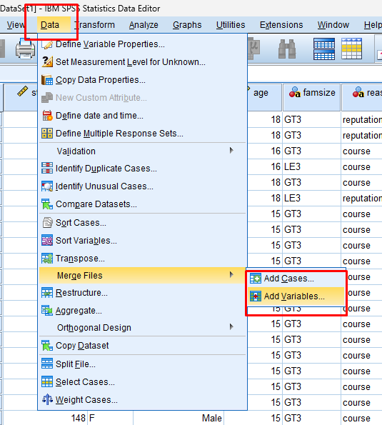 | 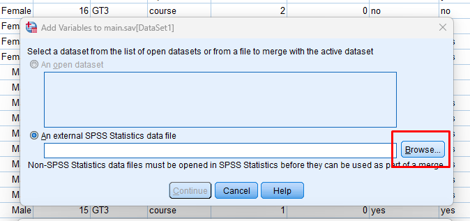|

| step 3 | step 4 |
|------|-------------|
|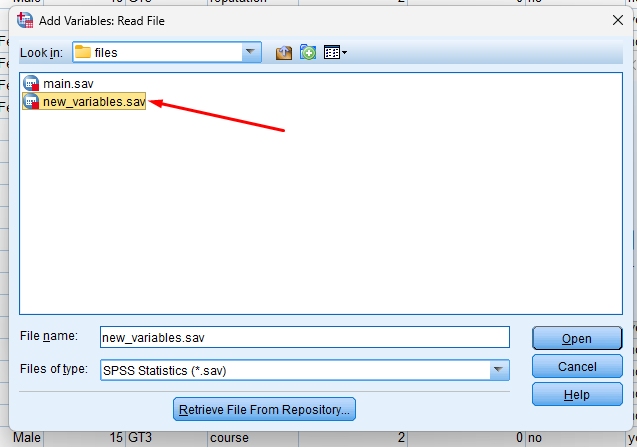 | 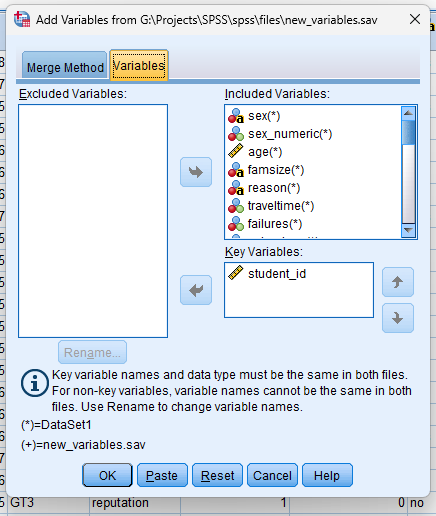|

| step 5 | step 6 |
|------|-------------|
|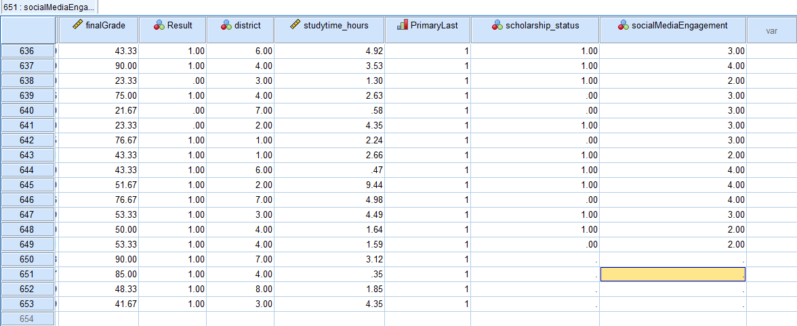 | 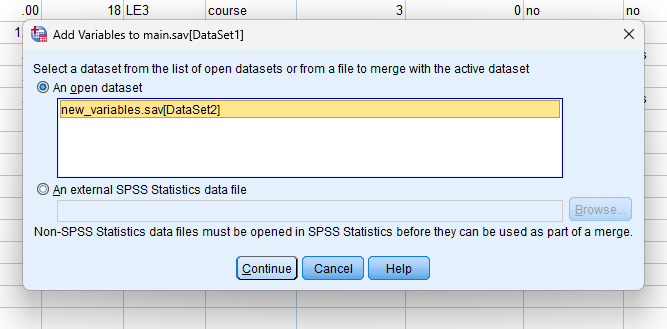|


**Always run frequencies after merging and inspect the output for mismatches or missing values.**

### Situation 2: Add Cases

If you have new student responses:

1. Ensure variable names and types match the existing dataset.
2. Go to `Data > Merge Files > Add Cases`.
3. Append the new rows.
4. Run frequencies to validate the merged result.


---

## Select Cases in SPSS

Purpose: Temporarily isolate a subset of data for analysis while keeping other rows in the file.

Path: `Data > Select Cases > If condition is satisfied > Condition`

Examples:

1. Students with internet access:

```spss
SELECT IF (internet = 'yes').
EXECUTE.
```

2. Students who study 3 or more units:

```spss
SELECT IF (studytime >= 3).
EXECUTE.
```

3. Restore all cases:

```spss
USE ALL.
EXECUTE.
```

> Screenshot placeholder: Select Cases condition dialog.

---

## Descriptive Statistics in SPSS

1. Go to `Analyze > Descriptive Statistics > Descriptives`.
2. Move target variables to the analysis box.
3. Click `Options` to add statistics (variance, range, and others).
4. Click `OK` to run and inspect output.

Frequency tables are also essential descriptive checks for categorical variables, I have shown how to run frequencies in the data cleaning section, but you can also run them at any point to check distributions after transformations.

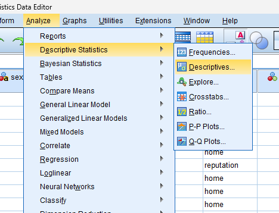
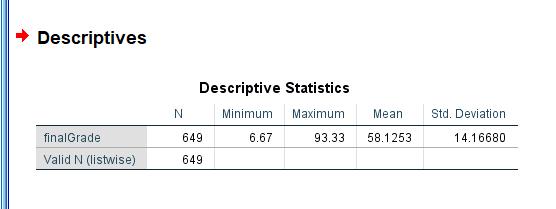

---

## Custom Tables in SPSS

Custom Tables are powerful for structured analysis and reporting.

1. Go to `Analyze > Tables > Custom Tables`.
2. Apply the *golden rule*:
	 - drag a variable to *Rows* if it is a group/category you want to compare(district,scholarship_status etc).
	 - drag a variable to *Columns* if it is a measure/statistic/data (finalGrade,result etc)  you report.
3. select a row item or a column item, then click the ` Summary Statistics` button to choose relevant statistics (mean, count, percentage, etc.).

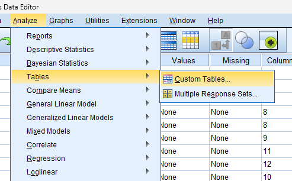
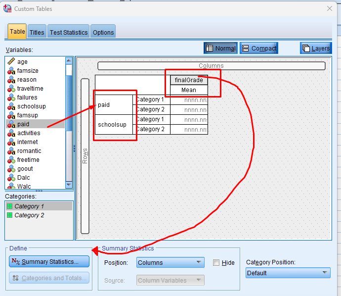
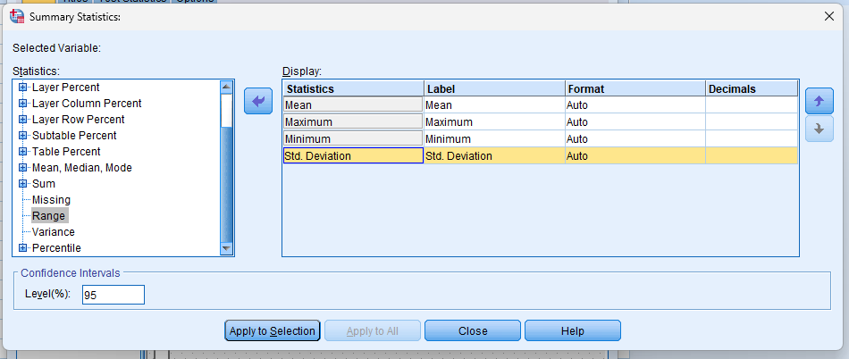

Practice questions:
1. How is the student population distributed across district and sex?
2. Do `schoolsup` and `paid` groups differ in `finalGrade`?
3. How do `studytime_hours` and `finalGrade` vary across combinations of `scholarship_status` and `internet`?

Example setups:

1. Rows: `district`; Columns: `sex`; Statistics: Row N%
2. Rows: `schoolsup`, `paid`; Columns: `finalGrade`; Statistics: Mean, Max, Min, Std. Dev.
3. Rows: `scholarship_status`, `internet`; Columns: `studytime_hours`, `finalGrade`; Statistics: Mean

1. 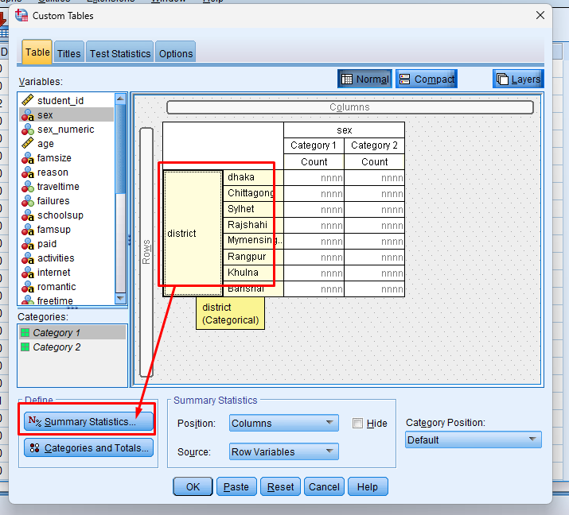 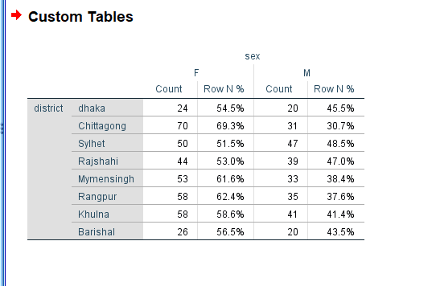
2. 
3. 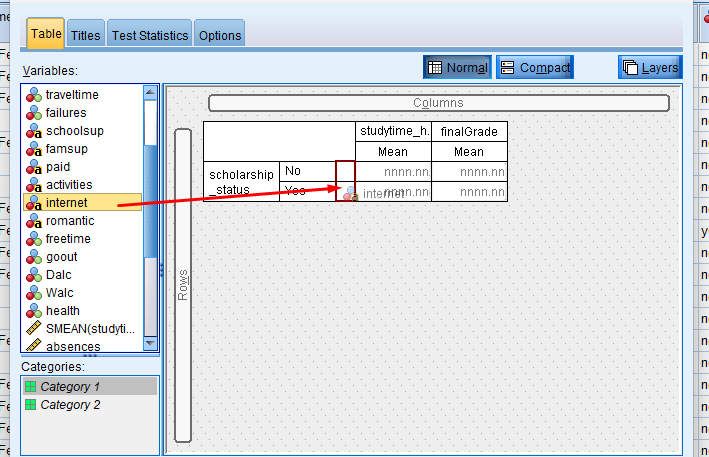
	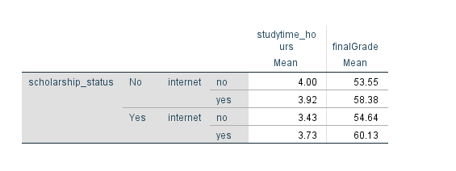
---
## Correlation Analysis

To analyze the relationship between `studytime_hours` and `finalGrade`:

1. Go to `Analyze > Correlate > Bivariate`.
2. Move both variables to the analysis box.
3. Ensure `Pearson` is selected.
4. Click `OK` to run and inspect output, or click `Paste` and run from syntax.

Quick guide to interpret correlation output:

- Correlation coefficient (r): ranges from -1 to 1. Closer to ±1 indicates a stronger relationship.
- Sign of r: positive means both variables increase together; negative means one increases while the other decreases.
- Sig. 2-tailed (p-value): typically, p < 0.05 indicates a statistically significant correlation.

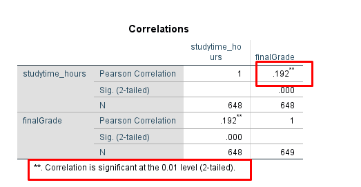
---

## Regression Analysis

Visualize the relationship between `studytime_hours` and `finalGrade` with a scatterplot, then run linear regression:

1. Scatterplot:
   - Go to `Graphs > Chart Builder`.
   - Choose Scatter/Dot and set `studytime_hours` on the x-axis and `finalGrade` on the y-axis.
   - Click `OK` to create the scatterplot.

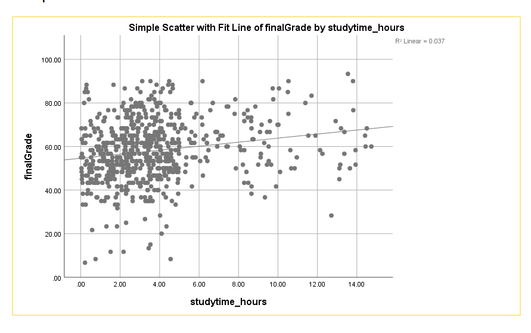

2. Linear Regression:
   - Go to `Analyze > Regression > Linear`.
   - Set `finalGrade` as the dependent variable and `studytime_hours` as the independent variable.
   - Click `OK` to run the model.
   - Run a second model with independent variables `scholarship_status` and `Dalc`, and dependent variable `finalGrade`.


| Step 1  | Step 2  |
|------|------|
| 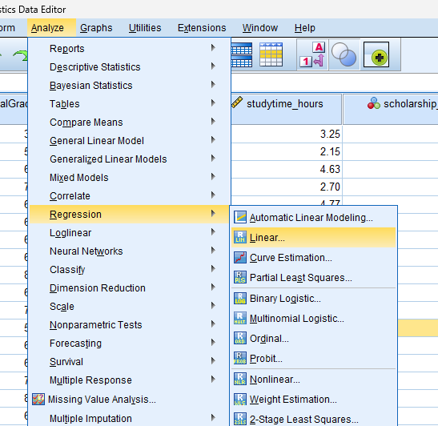 | 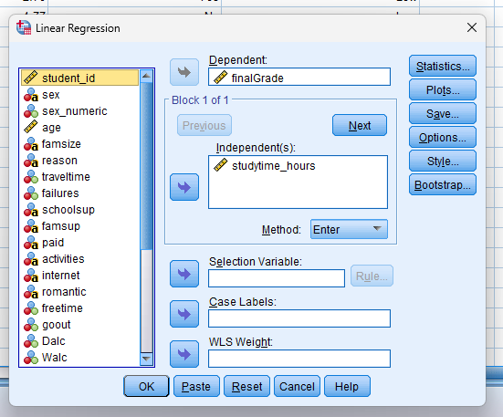 |

| Model 1 output | Model 2 output |
|------|------|
| 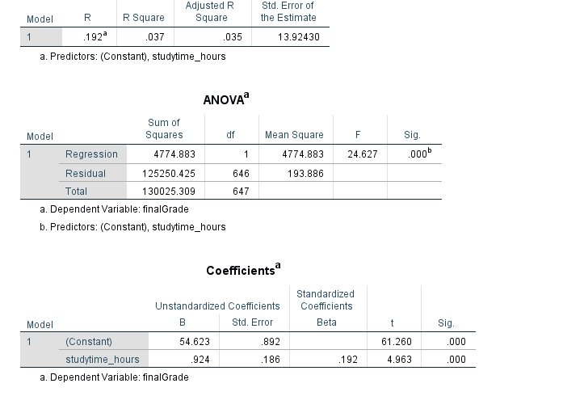 | 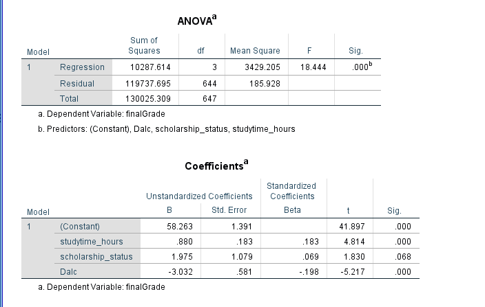 |

---

## Export Cleaned Dataset

After validation, export the cleaned data for sharing or further analysis:

1. Save final `.sav`.
2. Export to Excel (`File > Export > Excel`).
3. Store outputs in `data/cleaned`.

---

## SPSS Syntax Quick Reference

### Basic Command Pattern

- Most commands end with a period `.`
- Use `EXECUTE.` to force immediate transformation execution

### Compute Variables

```spss
COMPUTE bmi = weight / ((height / 100) ** 2).
EXECUTE.
```

### Recode Values

```spss
RECODE score (Lowest THRU 39 = 0) (40 THRU Highest = 1) INTO pass_flag.
EXECUTE.
```

### Filter Cases

```spss
SELECT IF (PrimaryLast = 1).
EXECUTE.
```

### Frequencies for Data Checks

```spss
FREQUENCIES VARIABLES = sex studytime finalGrade.
```

---

## Notes

- Keep source data unchanged in `data/raw`.
- Keep all transformation steps in `spss/syntax/Syntax.sps` for reproducibility.
